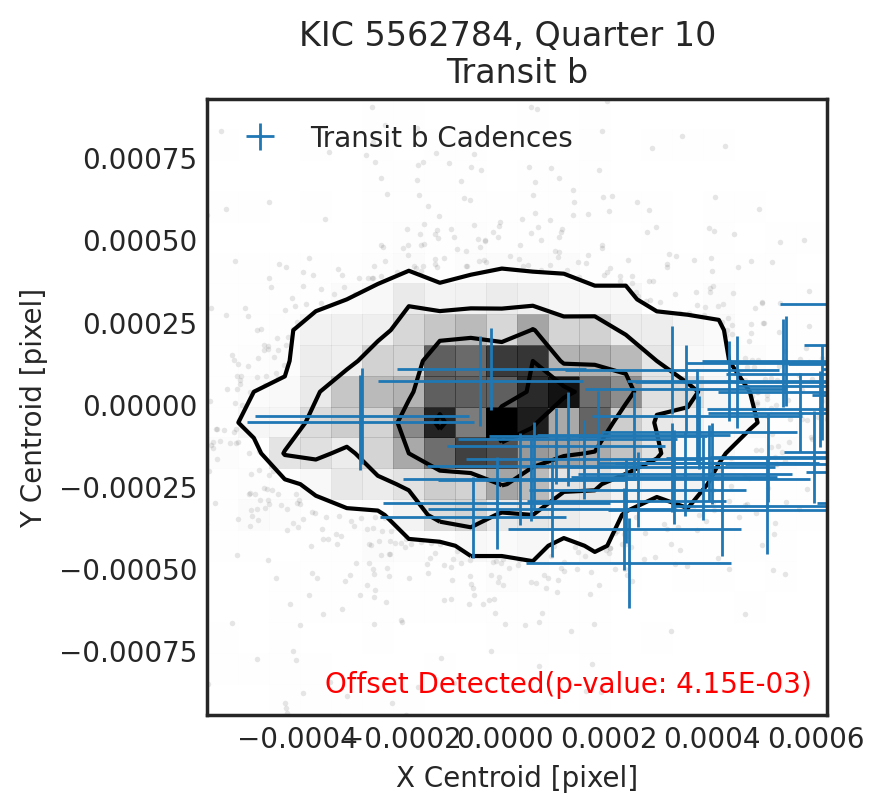

# vetting

`vetting` contains simple, stand-alone Python tools for vetting transiting signals in NASA's Kepler, K2 and TESS data. `vetting` requires an installation of Python 3.8 or higher.

## Installation

You can install `vetting` by executing the following in a terminal

```
pip install vetting
```

### Centroid testing

An example of a simple test is shown below.



Here a significant offset is detected in the centroid of false positive KOI-608 during transit. The p-value for the points during transit being drawn from the same distribution as the points out of transit is low, (there is a less than 1% chance these are drawn from the same distribution). To recreate this example you can use the following script:

```python
import lightkurve as lk
from vetting import centroid_test

tpf = lk.search_targetpixelfile('KOI-608', mission='Kepler', quarter=10).download()
period, t0, dur = 25.3368592, 192.91552, 8.85/24
r = centroid_test(tpf, period, t0, dur, aperture_mask='pipeline', plot=False)
```
